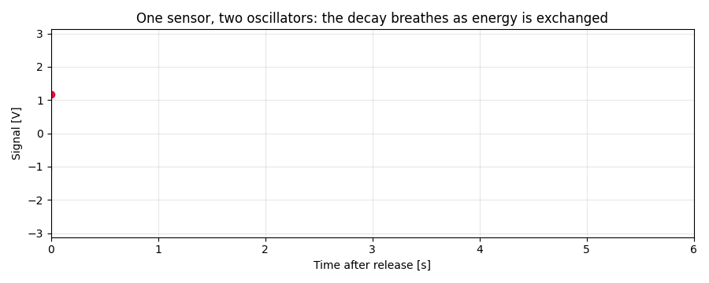
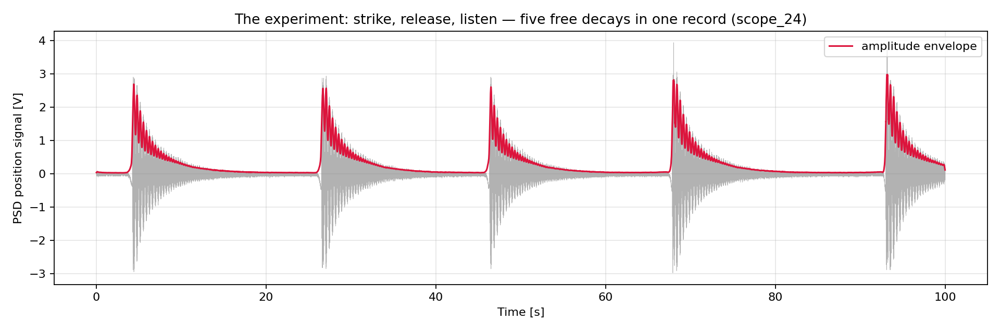
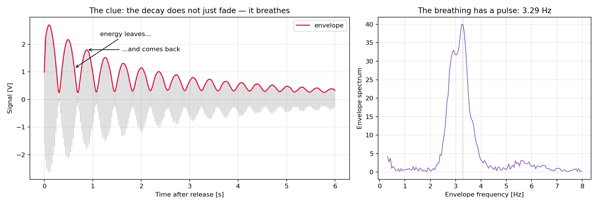
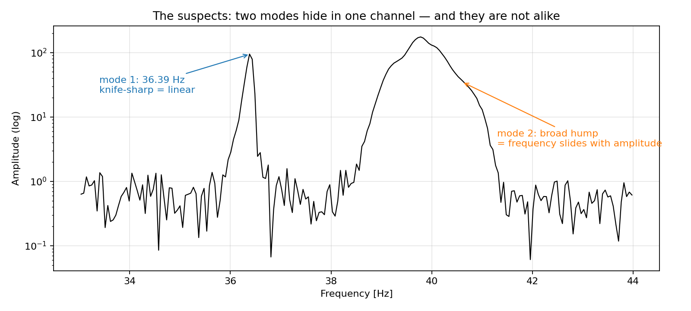
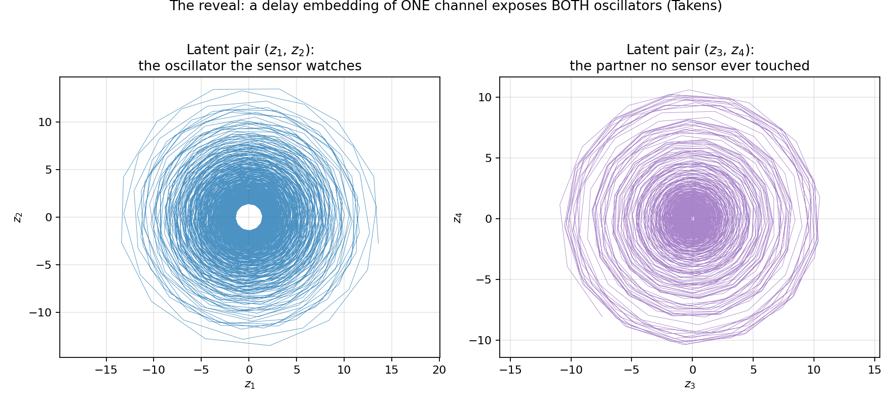
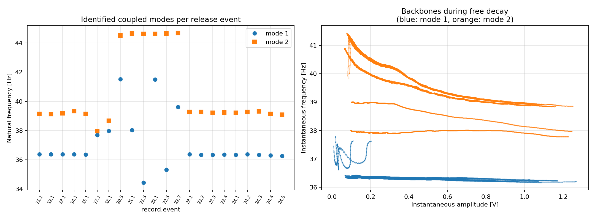
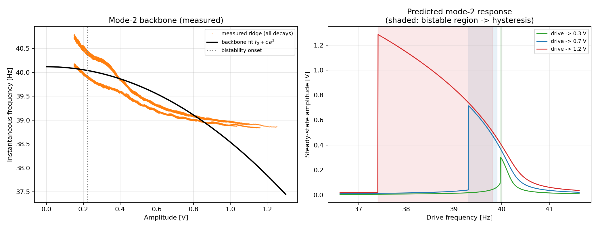
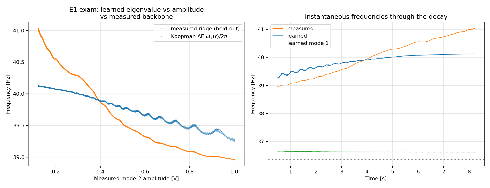

# Coupled-Resonator Identification

[](https://github.com/Rafael153Leonardo/coupled-resonator-identification/actions/workflows/ci.yml)
[](LICENSE)


**One sensor. Two oscillators. The second one never touched a probe.**

Two cantilevers share a coupling spring; an optical position sensor watches
only one of them. This repository extracts *both* natural frequencies, both
damping ratios, the coupling rate, each mode's frequency-vs-amplitude
backbone — and ends with a falsifiable prediction — from nothing but
free-decay records of that single channel.



---

## Act 1 — Strike, release, listen

A Hamamatsu 1-D PSD (µm-scale optical position sensing) stares at one
cantilever while it is struck and released, over and over. A bench
oscilloscope streams the position at 1–5 kHz for 20–100 s per record. That is
the entire experiment — no force sensor, no second channel.



`data/` holds 15 such records. A hysteresis (Schmitt-trigger) detector cuts
each record into individual decays without being fooled by what comes next.

## Act 2 — The clue: the decay *breathes*

A lone damped oscillator fades monotonically. This one doesn't — its envelope
swells and collapses with a clean pulse of ~3 Hz. Amplitude that leaves and
*comes back* means the energy has somewhere to hide: there is a second
oscillator in the story, exchanging energy with the one we watch.



(That breathing is also why naive event detection fails here: any single
threshold re-triggers on the envelope bellies. The hysteresis detector is
immune by construction.)

## Act 3 — The suspects: two modes, and they are not alike

The spectrum of one decay confirms the pair — and hands us a second mystery.
The lower mode is knife-sharp, the upper one is a broad hump. Same record,
same sensor, same processing: one resonance is textbook-linear, the other is
hiding something.



## Act 4 — The reveal: seeing the oscillator no sensor touched

Takens' theorem says a delay embedding of one channel reconstructs the full
state of the coupled system. Build a Hankel matrix of the measured signal,
keep the four dominant SVD directions, and the latent pairs organize
themselves into two phase portraits: the oscillator the sensor watches — and
its hidden partner.



A one-step propagator ``z_{k+1} = M z_k`` fitted on those latents (DMD/ERA
style — no numerical differentiation, hence none of its damping/frequency
biases) turns the portraits into numbers, per release event:

| Configuration | Records | Result |
| --- | --- | --- |
| A: strong coupling | 11–15, 23, 24 (14 decays) | f₁ = **36.356 ± 0.032 Hz**, f₂ = 39.213 ± 0.074 Hz, splitting **2.857 ± 0.065 Hz**, ζ₁ ≈ 0.0033, ζ₂ ≈ 0.0011 |
| B: weak coupling | 17, 18 | close pairs, splitting 0.28 / 0.69 Hz |
| C: single resonator | 20–22 | f = 44.62 ± 0.05 Hz, ζ ≈ 0.0155 |



The mass-free coupling rate: **g = (f₂−f₁)/2 = 1.430 ± 0.033 Hz**. The
lower-mode frequency matches an independent analysis of the same rig (tagged
36.334 / 36.35 / 36.311 Hz) within the ensemble spread.

## Act 5 — The twist, and a bet anyone can call

Why was mode 2 a broad hump? Band-pass it, follow its Hilbert ridge through
the decay, and the answer is a **softening backbone**: mode 2 slides from
~40.1 Hz at small amplitude down to ~38.9 Hz at 1.2 V. Three independent
fingerprints agree — the broad spectral hump, the measured backbone, and the
beat rate running ~10% above the average splitting (the instantaneous
splitting grows as the mode chirps up during the decay).

A softening resonance past a critical amplitude folds over and becomes
**bistable**. From the measured backbone (α_eff = −6.7·10³ V⁻²s⁻²) and the
DMD damping, the onset is only **0.22 V** — far below what the decays reach.
So the toolkit closes with a quantitative, testable prediction:



| Drive level (peak response) | Predicted bistable window |
| --- | --- |
| 0.3 V | 39.97 – 40.01 Hz |
| 0.7 V | 39.31 – 39.91 Hz |
| 1.2 V | **37.41 – 39.81 Hz (2.4 Hz wide)** |

A stepped-sine up/down sweep of mode 2 must jump at different frequencies in
each direction, inside these windows. **Anyone with access to the rig can
falsify this table — that is the point.**

---

## Reproducing the physics with learned models

Can the data-driven methods of *Data-Driven Science and Engineering*
(Brunton & Kutz) and autoencoders rediscover all of the above on their own?
The classical numbers become the exam ([`docs/learned-models-plan.md`](docs/learned-models-plan.md);
`pip install -e ".[learned]"`):

- **E0 — discrete-time SINDy on the latents**
  (`scripts/run_sindy_latents.py`): *partial pass.* Model selection balances
  sparsity against rollout stability; the winner survives a 9.4 s held-out
  rollout and its linear part shifts toward the small-amplitude limit as the
  cubic terms are admitted — but it captures only ~0.3 Hz of the 2 Hz
  softening, and richer models blow up in simulation. Cartesian polynomial
  libraries struggle with strongly amplitude-dependent frequency.
- **E1 — parametrized Koopman autoencoder** (Lusch, Kutz & Brunton 2018)
  (`scripts/run_koopman_ae.py`): *pass with a caveat.* Two rotation pairs
  whose (decay, frequency) are learned functions of the pair radius — the
  construction built for continuous Koopman spectra. On records never seen in
  training, the learned ω₂(amplitude) tracks the measured backbone with
  **corr = 0.960 ± 0.002 (RMSE 0.40 Hz) over 8 decays**, while the learned
  mode 1 stays flat (std 0.009 Hz). The caveat: the softening *magnitude*
  comes out ~2× compressed — shape learned, scale still leashed to the latent
  radius calibration.



The two experiments make the same point from opposite sides: the physics the
classical pipeline extracted is discoverable by learned models, and the
architecture's inductive bias decides how much of it each one recovers.

## The toolkit (`src/coupled_id/`)

| Piece | What it contributes |
| --- | --- |
| `events.py` | Hysteresis release-event detection (beat-proof) and anti-aliased decimation |
| `modal.py` | Delay-embedded one-step-propagator (DMD/ERA) modal identification — differentiation-free, so neither the artificial damping of one-sided differences nor the ``sin(w dt)/dt`` warping of central differences biases the poles |
| `spectral.py` | Sub-bin spectral peaks, Hilbert-ridge backbones, envelope exchange rate |
| `physics.py` | Coupling rate / k_c/m from splitting, harmonic-balance driven response (cubic in a²; root multiplicity = bistability), backbone-vs-linewidth criterion |

Every estimator is validated against synthetic ground truth in
[`tests/test_coupled_id.py`](tests/test_coupled_id.py).

## Reproduce everything

```bash
python -m venv .venv
source .venv/bin/activate      # Windows: .venv\Scripts\activate
pip install -e ".[dev]"

pytest -q                                  # 8 synthetic validations
python scripts/run_coupled_modes.py        # per-event modal table + summary figure
python scripts/run_bistability_prediction.py  # coupling rate + hysteresis prediction
python scripts/make_story_figures.py       # the Act 1-4 figures
```

Data notes: `scope_16` is a byte-identical duplicate of `scope_15` (kept for
completeness, excluded from statistics); records 19 and 25 show no stable
modes and are left unclassified. Each `scope_N.txt` is the oscilloscope
settings dump paired with `scope_N_1.csv`. The backbone's quadratic fit is
the leading-order description (the measured backbone saturates near 38.9 Hz
at high amplitude), so the prediction is most reliable near onset; mode-2
nonlinear damping is not identifiable from decays alone and the prediction
uses its linear damping.

## Acknowledgments

The measurements were taken on the coupled-cantilever rig of the 2025.2
instrumentation course laboratory (prof. A. A. Batista), whose independent
analysis of the rig provided the reference values above. The identification
techniques, code and analysis in this repository are the author's.

## License

MIT — see [`LICENSE`](LICENSE).
